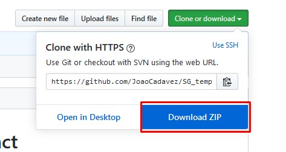

# Association between service graph templates and contracts
An ansible module that provides the possibility to associate service graph templates with contracts in ACI (Cisco)

# Installation

* Download the repository


* Extract Files


* Found the ansible python modules location folder


* Go to ```/network/aci```

* Paste the ```SG_template_association_with_contract.py```


* Test it!

```
Example

  - name: "Associate Service Graph Template with Contract"
    service_graph_module:
      host: IP ADDRESSS
      username: USER
      password: PWD
      tenant_name: TENAR
      contract_name: CONTRACT
      contract_subject: SUBJECT
      SG_template_name: SERVICE_GRAPH_NAME
      state: STATE (default : present)
      validate_certs: yes or no

```

**Contacts** : João Cadavez
**Linkedin** : linkedin.com/in/joaocadavez
**GitHub** : github.com/JoaoCadavez